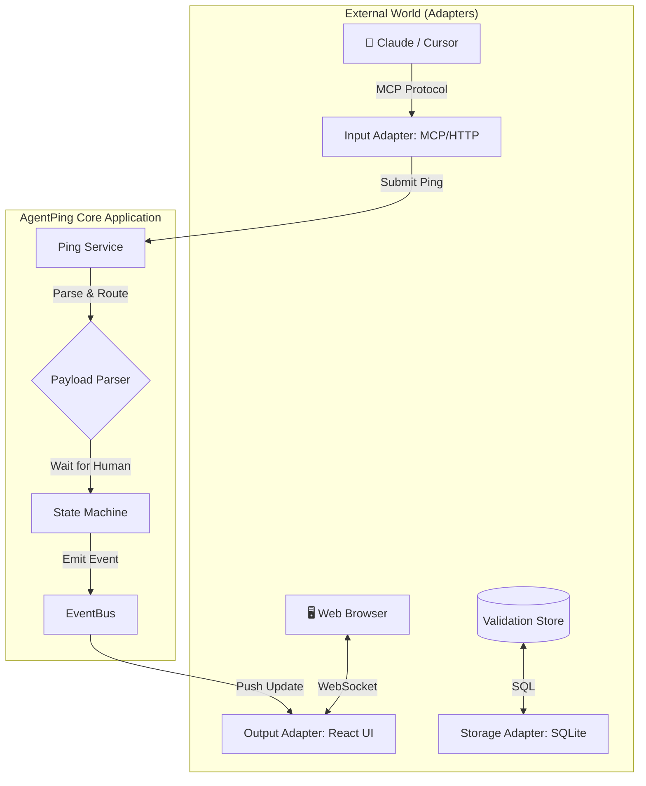
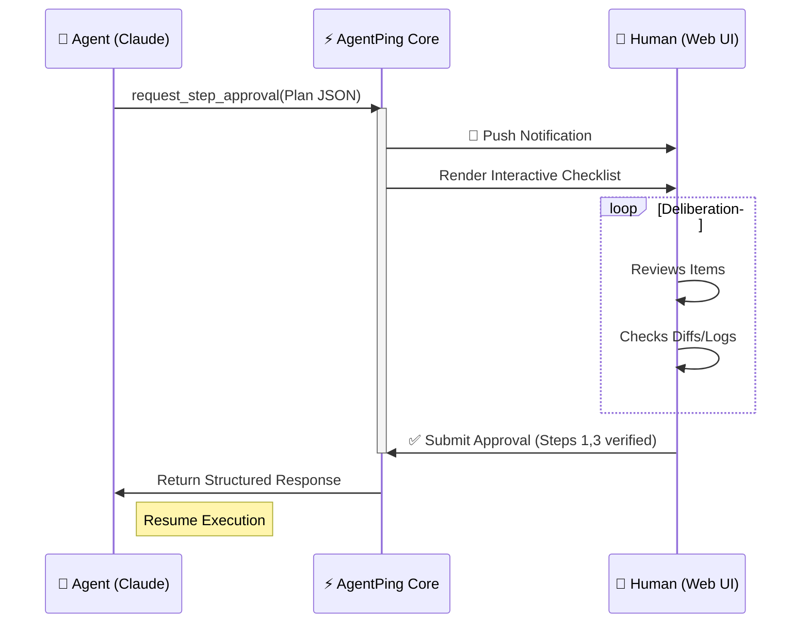

<p align="center">
  
  
  
  
</p>

<h1 align="center">⚡ AgentPing v2</h1>

<p align="center">
  <strong>The High-Fidelity Agent-Human Interaction Protocol</strong><br/>
  <em>"Don't just notify. Orchestrate."</em>
</p>

<p align="center">
  <a href="#-the-mission">Mission</a> •
  <a href="#-architecture">Architecture</a> •
  <a href="#-human-in-the-loop-gallery">Capabilities</a> •
  <a href="#-mcp--agent-integration">MCP Protocol</a> •
  <a href="#-quick-start">Quick Start</a>
</p>

---

## 🌌 The Mission

**The chat box is a bottleneck.**

We are entering the age of autonomous agents—programs that code, trade, research, and operate infrastructure. Yet, our main way of directing them is still... texting?

When a high-performance agent needs human guidance, it usually dumps a wall of text and asks for a "yes/no". This is low-fidelity, fragile, and frankly, boring. It forces you to function as a spell-checker rather than a commander.

**AgentPing exists to change the topology of collaboration.**

We believe that **High-Agency AI deserves High-Fidelity UI**. When your agent drafts a deployment plan, it shouldn't just send text; it should present an interactive checklist with risk scores. When it analyzes a market, it should render an interactive heatmap, not a CSV summary.

**We are building the protocol for Orchestration.**
AgentPing transforms your relationship with AI from "chatting" to "conducting". It gives your agents the power to summon rich, "Cyber-Premium" interfaces on demand, allowing you to visualize their internal state, adjust their trajectory with precision, and approve their critical actions with confidence.

It's not just a tool. It's the **Mission Control** for the agentic future.

---

## 🏗 Architecture

AgentPing is built on a strict **Hexagonal Architecture (Ports & Adapters)**, ensuring the core logic is isolated from the "Real World" (UIs, APIs, Databases).



### The "Ping" Lifecycle



---

## 🎨 Human-in-the-Loop Gallery

We have digitized every possible interaction pattern into **150+ "Primitives"**. The Gallery is categorized into specialized domains:

### 📊 1. Mission Control Dashboard
*   **System Health**: `SystemHealthGauge` (CPU/Mem/Net), `ResourceGauge` (Neon Glow), `BatteryMeter`.
*   **Live Metrics**: `MetricChart`, `StorageDistribution`, `ActiveSessions`.
*   **Status**: `StatusCard`, `AlertBanner` (Critical/Warning), `LiveBadge`.

### 🧠 2. AI Intelligence & Telemetry
> *Visualize what your agent is "thinking".*
*   **Thought Process**: `TokenStream` (Real-time LLM output), `ConfidenceMeter`.
*   **Operation**: `ModelSelector`, `ContextUsage`, `ToolInvocation` (Function calls).
*   **Analysis**: `VectorCluster` (Embedding viz), `BrainActivity` (Neural pulses).
*   **Identity**: `AgentAvatar`, `MessageBubble` (Typewriter effect).

### 🛠 3. Data Engineering & Logs
> *Deep-dive into system internals.*
*   **Logs**: `LiveLogStream` (Tail-F style), `LogSearchQuery`, `StackTraceProfiler`.
*   **Inspector**: `HttpInspector` (Headers/Bodies), `JsonDiffViewer`, `HexInspector`.
*   **Pipelines**: `SankeyDiagram` (Data flow), `SchemaGraph` (ER Diagrams).
*   **Structure**: `DataGrid` (Virtual scroll), `TreeBrowser`, `FileMetadataCard`.

### 💵 4. Financial Operations
> *High-frequency trading interfaces.*
*   **Market Data**: `CandleStickChart`, `OrderBook` (L2 Data), `DepthChart`.
*   **Portfolio**: `AssetCard`, `PortfolioPie`, `TradeHistory`.
*   **Analysis**: `MarketHeatmap`, `ForecastingLine`, `ExchangeStatus`.

### 📝 5. Content & Code
*   **Code Review**: `CodeDiffViewer` (Syntax highlighted), `DiffStatSummary`, `MergeConflictResolver`.
*   **Files**: `FileAssetPicker`, `ImageCompare` (Slider/Overlay), `PdfPreview`, `CsvViewer`.
*   **Text**: `RichMarkdownRenderer` (GFM), `MarkdownEditor`.

### 📅 6. Scheduling & Time
*   **Calendars**: `CalendarView` (Interactive), `WeeklySchedule`, `DailyAgenda`.
*   **Time**: `WorldClock`, `TimezoneSlider`, `RecurringRuleEditor`.
*   **Events**: `EventCard`, `CountdownWidget`, `Timeline`.

### 🔐 7. Forms & Inputs
*   **Input**: `PinInput` (OTP), `TagInput`, `SecretInput` (Masked).
*   **Controls**: `Knob` (Rotary), `RangeSlider`, `ColorPicker`, `Rating`.
*   **Selection**: `TransferList` (Dual list), `SegmentedControl`.

### 🛡️ 8. System Ops & Security
*   **NetSec**: `FirewallRules`, `PacketInspector`, `EncryptionStatus` (Quantum-Safe).
*   **Hardware**: `ServerRackStatus`, `SignalMonitor` (RF), `ProcessTable`.
*   **Console**: `TerminalConsole` (Interactive TUI), `AccessPad`.
    > *Now supporting fully interactive Text UIs via `agentping` console.*

### 🧩 9. Core & Feedback
*   **Notifications**: `ToastManager`, `NotificationBanner`.
*   **Progress**: `CircularProgress`, `LoadingProgress`, `Skeleton` (Shimmer).
*   **Navigation**: `DockMenu` (macOS style), `RadialNav`, `SidePanel`.

---

## 🔗 MCP & Agent Integration

AgentPing is fully compatible with the **Model Context Protocol (MCP)**. This means you can add it to **Claude Desktop**, **Cursor**, or any MCP client with zero code.

### Supported Tools

| Tool Name | Description |
| :--- | :--- |
| `request_step_approval` | **Best Seller**. Agent proposes a plan (checklist). You verify items, check boxes, and approve/deny specific steps. |
| `request_research_direction` | Agent asks: *"I found 3 paths. Which should I prefer?"*. You select priorities and effort levels. |
| `request_selection` | Agent presents options (databases, APIs, strategies). You pick one or many. |
| `ask_human` | The classic. Agent asks a question, you type an answer. |
| `notify_human` | Fire-and-forget. *"Deployment complete."* |
| `request_code_review` | Agent shows a diff. You review lines and approve changes. |

### Config for Claude Desktop

Add this to your `claude_desktop_config.json`:

```json
{
  "mcpServers": {
    "agentping": {
      "command": "npx",
      "args": ["-y", "@agentping/mcp"],
      "env": {
        "AGENTPING_URL": "http://localhost:3000"
      }
    }
  }
}
```

Now, you can simply tell Claude:
> *"Scan the codebase for errors. If you find any critical ones, ping me with a 'Step Approval' request before fixing them."*

---

## 🚀 Quick Start

### 1. Start the System
AgentPing runs as a local daemon + web server.

```bash
# 1. Install Dependencies
pnpm install

# 2. Start the Daemon & UI (Parallel)
npm run dev
# This starts:
# - HTTP Server (:3000)
# - Web UI (:5173)
# - MCP Server (Stdio/SSE)
```

### 2. View the Interface
Open [http://localhost:5173](http://localhost:5173). You will see the **Primitives Gallery** by default.

### 3. Launch the Console (TUI)
Open a new terminal tab to start the interactive Mission Control:

```bash
agentping
```
*(Or use `npm run tui` if you prefer)*

### 4. Send a Test Ping
Open another terminal:

```bash
# Send a notification
agentping notify "System Initialized 🚀"

# Send a checklist
agentping approve-steps --file urgent_plan.json
```

---

## 📂 Project Structure

```text
/
├── packages/
│   ├── core/               # 🧠 Domain Logic (No Ext. Deps)
│   ├── daemon/             # 🦾 Main Orchestrator
│   └── adapters/
│       ├── web-ui/         # ⚛️ React + Vite + Cyber-Premium CSS
│       ├── mcp/            # 🔌 Claude/Cursor Integration
│       ├── http-api/       # 🌐 REST + WebSocket Layer
│       ├── storage-sqlite/ # 💾 Local Persistence
│       ├── cli/            # 💻 Terminal Interface
│       ├── slack/          # 💬 Chat Adaptation
│       └── webhook/        # 🔗 Event Hooks
└── docs/                   # 📚 Architectural Decision Records (ADRs)
```

---

<p align="center">
  <sub>Built with ❤️ by <strong>Kingly Agency</strong></sub><br/>
  <sub><em>Advanced Agentic Coding</em></sub>
</p>
