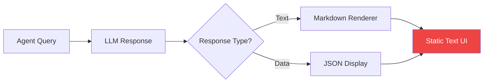
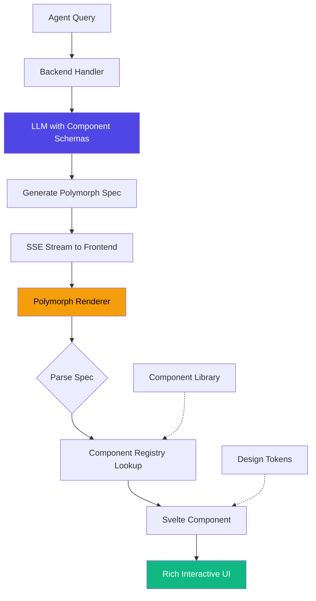

# AgentPing Polymorph: Migration to Spec-Based Rendering

> Status: Research/Input
> Runtime Contract: `docs/architecture.md`
> This document is design/research guidance, not runtime source-of-truth.

**Based on Thesys C1 Research**
**Date:** 2026-02-10

---

## Current State vs Target State

### Current (Assumed)



**Problems:**
- Limited visual richness
- No progressive rendering
- Hard to show complex data (metrics, status, timelines)
- Inconsistent UI quality

### Target (Spec-Based Rendering)



**Benefits:**
- Rich, interactive UI components
- Progressive streaming UX
- Consistent visual quality via design system
- Type-safe rendering pipeline

---

## Implementation Phases

### Phase 1: Foundation (Week 1)

**Deliverables:**
- [ ] Design token system (colors, spacing, typography)
- [ ] Base Svelte component library (5-10 core components)
- [ ] Component registry infrastructure
- [ ] Polymorph spec schema (Zod definitions)

**Components to Build:**
```
core/polymorph/components/
├── AgentCard.svelte           # Shows single agent status
├── AgentGrid.svelte           # Grid of agents
├── MetricsChart.svelte        # Time-series data
├── TaskTimeline.svelte        # Chronological events
├── StatusBadge.svelte         # Online/Busy/Offline indicator
├── MetricCounter.svelte       # Single numeric metric
├── ConversationThread.svelte  # Chat-like interface
└── ErrorState.svelte          # Fallback for invalid data
```

**Schema Example:**
```typescript
// schemas/polymorph.ts
export const AgentCardSchema = z.object({
  agentId: z.string(),
  name: z.string(),
  status: z.enum(['online', 'busy', 'offline', 'error']),
  currentTask: z.string().optional(),
  metrics: z.object({
    tasksCompleted: z.number(),
    avgResponseTime: z.number(),
    uptime: z.string(),
  }).optional(),
  lastSeen: z.string(),
}).describe(
  "Displays a single agent's status card with real-time metrics. " +
  "Use for showing individual agent health, current activity, and performance stats. " +
  "Supports online/busy/offline states with visual indicators."
);
```

### Phase 2: Renderer (Week 2)

**Deliverables:**
- [ ] PolymorphRenderer.svelte component
- [ ] SSE streaming client
- [ ] JSON parsing with error handling
- [ ] Loading states and skeletons
- [ ] Component mounting animations

**Renderer Architecture:**

```svelte
<!-- PolymorphRenderer.svelte -->
<script lang="ts">
  import { onMount } from 'svelte';
  import { fade, slide } from 'svelte/transition';
  import { POLYMORPH_COMPONENTS } from '$lib/registry';
  import SkeletonLoader from './SkeletonLoader.svelte';
  import ErrorBoundary from './ErrorBoundary.svelte';

  export let spec: string = '';
  export let isStreaming: boolean = false;

  let parsedSpec: any = null;
  let parseError: Error | null = null;

  $: {
    try {
      parsedSpec = spec ? JSON.parse(spec) : null;
      parseError = null;
    } catch (e) {
      if (!isStreaming) {
        parseError = e as Error;
      }
      // During streaming, incomplete JSON is expected
    }
  }

  function resolveComponent(node: any) {
    if (!node?.component) return null;

    const Component = POLYMORPH_COMPONENTS[node.component];
    if (!Component) {
      console.warn(`Unknown component: ${node.component}`);
      return null;
    }

    return { Component, props: node.props || {}, children: node.children };
  }
</script>

<div class="polymorph-container">
  {#if parseError}
    <ErrorBoundary error={parseError} />
  {:else if parsedSpec}
    {@const resolved = resolveComponent(parsedSpec)}
    {#if resolved}
      <div transition:fade={{ duration: 300 }}>
        <svelte:component this={resolved.Component} {...resolved.props}>
          {#if resolved.children}
            {#each resolved.children as child (child.id || Math.random())}
              <svelte:self spec={JSON.stringify(child)} />
            {/each}
          {/if}
        </svelte:component>
      </div>
    {:else}
      <ErrorBoundary error={new Error('Unknown component type')} />
    {/if}
  {:else if isStreaming}
    <SkeletonLoader />
  {:else}
    <div class="empty-state">
      <p>No content to display</p>
    </div>
  {/if}
</div>

<style>
  .polymorph-container {
    width: 100%;
    min-height: 200px;
  }

  .empty-state {
    display: flex;
    align-items: center;
    justify-content: center;
    height: 200px;
    color: var(--color-text-muted);
  }
</style>
```

### Phase 3: Backend Integration (Week 3)

**Deliverables:**
- [ ] Polymorph generation API endpoint
- [ ] Schema registration with LLM
- [ ] SSE streaming implementation
- [ ] Error handling and fallbacks
- [ ] System prompts for quality

**Backend API:**

```typescript
// api/polymorph/generate/+server.ts
import { Anthropic } from '@anthropic-ai/sdk';
import { POLYMORPH_SCHEMAS } from '$lib/registry';
import { json } from '@sveltejs/kit';
import type { RequestHandler } from './$types';

const SYSTEM_PROMPT = `You are an AgentPing interface generator. Your role is to create rich, interactive UI specifications for displaying agent data.

AVAILABLE COMPONENTS:
${JSON.stringify(POLYMORPH_SCHEMAS, null, 2)}

RULES:
1. Always respond with valid JSON matching the Polymorph spec schema
2. Choose the most appropriate component for the user's intent
3. For agent status queries, use AgentCard or AgentGrid
4. For metrics/analytics, use MetricsChart
5. For task history, use TaskTimeline
6. Include all required fields in component props
7. Prefer richer components (charts) over plain text when data supports it
8. Keep responses focused — don't generate multiple top-level components unless needed
9. Use descriptive task names and clear status indicators
10. For real-time data, include timestamps

QUALITY STANDARDS:
- All timestamps in ISO 8601 format
- Metric values should be numbers, not strings
- Status values must match enum options exactly
- Agent IDs should be preserved from query context
- Include optional fields when data is available
`;

export const POST: RequestHandler = async ({ request }) => {
  const { query, context } = await request.json();

  const anthropic = new Anthropic({
    apiKey: process.env.ANTHROPIC_API_KEY,
  });

  const stream = new ReadableStream({
    async start(controller) {
      try {
        const messageStream = await anthropic.messages.stream({
          model: 'claude-sonnet-4-5-20250929',
          max_tokens: 4096,
          system: SYSTEM_PROMPT,
          messages: [
            {
              role: 'user',
              content: `Query: ${query}\n\nContext: ${JSON.stringify(context, null, 2)}\n\nGenerate a polymorph spec:`,
            },
          ],
        });

        for await (const chunk of messageStream) {
          if (chunk.type === 'content_block_delta' && chunk.delta.type === 'text_delta') {
            controller.enqueue(new TextEncoder().encode(chunk.delta.text));
          }
        }

        controller.close();
      } catch (error) {
        console.error('Polymorph generation error:', error);
        controller.error(error);
      }
    },
  });

  return new Response(stream, {
    headers: {
      'Content-Type': 'text/event-stream',
      'Cache-Control': 'no-cache',
      'Connection': 'keep-alive',
    },
  });
};
```

### Phase 4: AgentPing Integration (Week 4)

**Deliverables:**
- [ ] Replace markdown renderer with PolymorphRenderer
- [ ] Agent query detection and routing
- [ ] Real-time data integration
- [ ] User interaction handlers (onAction equivalent)
- [ ] E2E testing

**Integration Point:**

```svelte
<!-- routes/dashboard/+page.svelte -->
<script lang="ts">
  import PolymorphRenderer from '$lib/components/PolymorphRenderer.svelte';
  import { agentStore } from '$lib/stores/agents';

  let query = '';
  let polymorphSpec = '';
  let isStreaming = false;

  async function handleQuery() {
    if (!query.trim()) return;

    isStreaming = true;
    polymorphSpec = '';

    try {
      const response = await fetch('/api/polymorph/generate', {
        method: 'POST',
        headers: { 'Content-Type': 'application/json' },
        body: JSON.stringify({
          query,
          context: {
            agents: $agentStore.agents,
            tasks: $agentStore.recentTasks,
            metrics: $agentStore.systemMetrics,
          },
        }),
      });

      const reader = response.body?.getReader();
      if (!reader) throw new Error('No response stream');

      const decoder = new TextDecoder();

      while (true) {
        const { done, value } = await reader.read();
        if (done) break;

        polymorphSpec += decoder.decode(value, { stream: true });
      }
    } catch (error) {
      console.error('Query error:', error);
      polymorphSpec = JSON.stringify({
        component: 'ErrorState',
        props: { error: error.message },
      });
    } finally {
      isStreaming = false;
    }
  }
</script>

<div class="agentping-dashboard">
  <header>
    <h1>AgentPing Control Center</h1>
    <form on:submit|preventDefault={handleQuery}>
      <input
        type="text"
        bind:value={query}
        placeholder="Ask about agent status, metrics, or tasks..."
        class="query-input"
      />
      <button type="submit" disabled={isStreaming}>
        {isStreaming ? 'Generating...' : 'Ask'}
      </button>
    </form>
  </header>

  <main>
    <PolymorphRenderer {polymorphSpec} {isStreaming} />
  </main>
</div>

<style>
  .agentping-dashboard {
    max-width: 1200px;
    margin: 0 auto;
    padding: 2rem;
  }

  .query-input {
    width: 100%;
    padding: 0.75rem 1rem;
    font-size: 1rem;
    border: 2px solid var(--color-border);
    border-radius: 8px;
    transition: border-color 0.2s;
  }

  .query-input:focus {
    outline: none;
    border-color: var(--color-primary);
  }

  button {
    margin-top: 1rem;
    padding: 0.75rem 1.5rem;
    background: var(--color-primary);
    color: white;
    border: none;
    border-radius: 8px;
    cursor: pointer;
    transition: opacity 0.2s;
  }

  button:disabled {
    opacity: 0.5;
    cursor: not-allowed;
  }
</style>
```

---

## Component Library Design

### Design Tokens

```css
/* styles/tokens.css */
:root {
  /* Colors */
  --color-primary: #4f46e5;
  --color-primary-hover: #4338ca;
  --color-success: #10b981;
  --color-warning: #f59e0b;
  --color-error: #ef4444;
  --color-text: #111827;
  --color-text-muted: #6b7280;
  --color-border: #e5e7eb;
  --color-bg: #ffffff;
  --color-bg-muted: #f9fafb;

  /* Spacing */
  --space-xs: 0.25rem;   /* 4px */
  --space-sm: 0.5rem;    /* 8px */
  --space-md: 1rem;      /* 16px */
  --space-lg: 1.5rem;    /* 24px */
  --space-xl: 2rem;      /* 32px */
  --space-2xl: 3rem;     /* 48px */

  /* Typography */
  --font-sans: -apple-system, BlinkMacSystemFont, 'Segoe UI', Roboto, sans-serif;
  --font-mono: 'SF Mono', Monaco, 'Cascadia Code', monospace;
  --font-size-xs: 0.75rem;   /* 12px */
  --font-size-sm: 0.875rem;  /* 14px */
  --font-size-md: 1rem;      /* 16px */
  --font-size-lg: 1.125rem;  /* 18px */
  --font-size-xl: 1.25rem;   /* 20px */
  --font-size-2xl: 1.5rem;   /* 24px */

  /* Borders */
  --border-radius-sm: 4px;
  --border-radius-md: 8px;
  --border-radius-lg: 12px;

  /* Shadows */
  --shadow-sm: 0 1px 2px rgba(0, 0, 0, 0.05);
  --shadow-md: 0 4px 6px rgba(0, 0, 0, 0.1);
  --shadow-lg: 0 10px 15px rgba(0, 0, 0, 0.1);
}

[data-theme="dark"] {
  --color-primary: #6366f1;
  --color-primary-hover: #818cf8;
  --color-text: #f9fafb;
  --color-text-muted: #9ca3af;
  --color-border: #374151;
  --color-bg: #111827;
  --color-bg-muted: #1f2937;
}
```

### Example Component: AgentCard

```svelte
<!-- components/AgentCard.svelte -->
<script lang="ts">
  export let agentId: string;
  export let name: string;
  export let status: 'online' | 'busy' | 'offline' | 'error';
  export let currentTask: string | undefined = undefined;
  export let metrics: {
    tasksCompleted: number;
    avgResponseTime: number;
    uptime: string;
  } | undefined = undefined;
  export let lastSeen: string;

  const statusColors = {
    online: 'var(--color-success)',
    busy: 'var(--color-warning)',
    offline: 'var(--color-text-muted)',
    error: 'var(--color-error)',
  };

  function formatTimestamp(isoString: string) {
    const date = new Date(isoString);
    return new Intl.DateTimeFormat('en-US', {
      hour: 'numeric',
      minute: 'numeric',
      hour12: true,
    }).format(date);
  }
</script>

<div class="agent-card" data-status={status}>
  <div class="header">
    <div class="status-indicator" style="background: {statusColors[status]}" />
    <h3 class="agent-name">{name}</h3>
    <span class="agent-id">#{agentId}</span>
  </div>

  {#if currentTask}
    <div class="current-task">
      <span class="task-label">Current Task:</span>
      <p class="task-text">{currentTask}</p>
    </div>
  {/if}

  {#if metrics}
    <div class="metrics">
      <div class="metric">
        <span class="metric-value">{metrics.tasksCompleted}</span>
        <span class="metric-label">Tasks</span>
      </div>
      <div class="metric">
        <span class="metric-value">{metrics.avgResponseTime}ms</span>
        <span class="metric-label">Avg Response</span>
      </div>
      <div class="metric">
        <span class="metric-value">{metrics.uptime}</span>
        <span class="metric-label">Uptime</span>
      </div>
    </div>
  {/if}

  <div class="footer">
    <span class="last-seen">Last seen: {formatTimestamp(lastSeen)}</span>
  </div>
</div>

<style>
  .agent-card {
    background: var(--color-bg);
    border: 1px solid var(--color-border);
    border-radius: var(--border-radius-lg);
    padding: var(--space-lg);
    box-shadow: var(--shadow-sm);
    transition: box-shadow 0.2s, transform 0.2s;
  }

  .agent-card:hover {
    box-shadow: var(--shadow-md);
    transform: translateY(-2px);
  }

  .header {
    display: flex;
    align-items: center;
    gap: var(--space-sm);
    margin-bottom: var(--space-md);
  }

  .status-indicator {
    width: 12px;
    height: 12px;
    border-radius: 50%;
  }

  .agent-name {
    font-size: var(--font-size-lg);
    font-weight: 600;
    color: var(--color-text);
    margin: 0;
  }

  .agent-id {
    font-size: var(--font-size-sm);
    color: var(--color-text-muted);
    font-family: var(--font-mono);
  }

  .current-task {
    background: var(--color-bg-muted);
    padding: var(--space-sm) var(--space-md);
    border-radius: var(--border-radius-sm);
    margin-bottom: var(--space-md);
  }

  .task-label {
    font-size: var(--font-size-xs);
    color: var(--color-text-muted);
    text-transform: uppercase;
    letter-spacing: 0.05em;
  }

  .task-text {
    margin: var(--space-xs) 0 0;
    font-size: var(--font-size-sm);
    color: var(--color-text);
  }

  .metrics {
    display: grid;
    grid-template-columns: repeat(3, 1fr);
    gap: var(--space-md);
    margin-bottom: var(--space-md);
    padding-top: var(--space-md);
    border-top: 1px solid var(--color-border);
  }

  .metric {
    text-align: center;
  }

  .metric-value {
    display: block;
    font-size: var(--font-size-xl);
    font-weight: 600;
    color: var(--color-text);
  }

  .metric-label {
    display: block;
    font-size: var(--font-size-xs);
    color: var(--color-text-muted);
    margin-top: var(--space-xs);
  }

  .footer {
    font-size: var(--font-size-xs);
    color: var(--color-text-muted);
  }

  @media (max-width: 640px) {
    .metrics {
      grid-template-columns: 1fr;
    }
  }
</style>
```

---

## Testing Strategy

### Unit Tests (Vitest)

```typescript
// components/AgentCard.test.ts
import { render } from '@testing-library/svelte';
import { expect, test } from 'vitest';
import AgentCard from './AgentCard.svelte';

test('renders agent card with all props', () => {
  const { getByText } = render(AgentCard, {
    agentId: 'agent-001',
    name: 'Worker Agent',
    status: 'online',
    currentTask: 'Processing data pipeline',
    metrics: {
      tasksCompleted: 42,
      avgResponseTime: 250,
      uptime: '99.8%',
    },
    lastSeen: '2026-02-10T15:30:00Z',
  });

  expect(getByText('Worker Agent')).toBeInTheDocument();
  expect(getByText('#agent-001')).toBeInTheDocument();
  expect(getByText('Processing data pipeline')).toBeInTheDocument();
  expect(getByText('42')).toBeInTheDocument();
});

test('handles missing optional props', () => {
  const { container } = render(AgentCard, {
    agentId: 'agent-002',
    name: 'Idle Agent',
    status: 'offline',
    lastSeen: '2026-02-10T12:00:00Z',
  });

  expect(container.querySelector('.current-task')).toBeNull();
  expect(container.querySelector('.metrics')).toBeNull();
});
```

### Integration Tests (Playwright)

```typescript
// e2e/polymorph.spec.ts
import { test, expect } from '@playwright/test';

test('renders polymorph spec progressively', async ({ page }) => {
  await page.goto('/dashboard');

  // Type query
  await page.fill('input[placeholder*="agent status"]', 'Show all active agents');
  await page.click('button:has-text("Ask")');

  // Wait for streaming to start
  await expect(page.locator('.polymorph-container')).toBeVisible();

  // Should show skeleton initially
  await expect(page.locator('.skeleton-loader')).toBeVisible();

  // Wait for component to render
  await expect(page.locator('.agent-card')).toBeVisible({ timeout: 5000 });

  // Should have replaced skeleton
  await expect(page.locator('.skeleton-loader')).not.toBeVisible();

  // Verify component content
  const cards = page.locator('.agent-card');
  await expect(cards).toHaveCount(3); // Assuming 3 agents
});

test('handles invalid JSON gracefully', async ({ page }) => {
  // Mock API to return invalid JSON
  await page.route('/api/polymorph/generate', route => {
    route.fulfill({
      status: 200,
      body: '{"component": "AgentCard", "props": {invalid',
    });
  });

  await page.goto('/dashboard');
  await page.fill('input[placeholder*="agent status"]', 'Test query');
  await page.click('button:has-text("Ask")');

  // Should show error state
  await expect(page.locator('.error-boundary')).toBeVisible();
});
```

---

## Performance Considerations

### Streaming Optimization

**Problem:** JSON parsing can fail mid-stream

**Solution:** Implement incremental parsing

```typescript
// utils/incrementalJsonParser.ts
export class IncrementalJsonParser {
  private buffer = '';
  private depth = 0;
  private inString = false;
  private escaped = false;

  append(chunk: string): any | null {
    this.buffer += chunk;

    // Track JSON structure depth
    for (let i = 0; i < chunk.length; i++) {
      const char = chunk[i];

      if (this.escaped) {
        this.escaped = false;
        continue;
      }

      if (char === '\\') {
        this.escaped = true;
        continue;
      }

      if (char === '"') {
        this.inString = !this.inString;
        continue;
      }

      if (this.inString) continue;

      if (char === '{' || char === '[') {
        this.depth++;
      } else if (char === '}' || char === ']') {
        this.depth--;
      }
    }

    // Try to parse when depth returns to 0 (complete object)
    if (this.depth === 0 && this.buffer.trim()) {
      try {
        const parsed = JSON.parse(this.buffer);
        this.buffer = '';
        return parsed;
      } catch {
        // Still incomplete
        return null;
      }
    }

    return null;
  }

  reset() {
    this.buffer = '';
    this.depth = 0;
    this.inString = false;
    this.escaped = false;
  }
}
```

### Component Lazy Loading

```typescript
// registry/components.ts
export const POLYMORPH_COMPONENTS = {
  // Eagerly loaded (common components)
  AgentCard: () => import('./components/AgentCard.svelte'),
  StatusBadge: () => import('./components/StatusBadge.svelte'),

  // Lazy loaded (heavy components)
  MetricsChart: () => import('./components/MetricsChart.svelte'),
  TaskTimeline: () => import('./components/TaskTimeline.svelte'),
};

// Renderer handles async loading
async function loadComponent(name: string) {
  const loader = POLYMORPH_COMPONENTS[name];
  if (typeof loader === 'function') {
    const module = await loader();
    return module.default;
  }
  return loader;
}
```

---

## Success Metrics

**Before Launch:**
- [ ] All components pass accessibility audit (Lighthouse)
- [ ] Streaming renders in <300ms for simple components
- [ ] Progressive rendering shows partial UI within 100ms
- [ ] Error rate <1% for valid LLM outputs
- [ ] Mobile responsive across all components

**Post-Launch:**
- Monitor LLM component selection accuracy
- Track user satisfaction with visual UI vs text
- Measure perceived latency vs actual latency
- Gather feedback on missing components

---

## Rollout Plan

1. **Internal Testing** (Week 5)
   - Dogfood with internal team
   - Gather feedback on component quality
   - Identify missing component types

2. **Beta Release** (Week 6)
   - Opt-in flag for polymorph rendering
   - A/B test vs existing markdown renderer
   - Monitor error rates and user feedback

3. **General Availability** (Week 7)
   - Default to polymorph for all queries
   - Fallback to markdown for unsupported queries
   - Document component library for users

4. **Iteration** (Ongoing)
   - Add components based on user requests
   - Improve LLM selection accuracy via prompt tuning
   - Optimize streaming performance
   - Expand design system

---

## Conclusion

By adopting Thesys C1's spec-based rendering approach, AgentPing can transform its UI from static text/markdown to rich, interactive, progressively-rendered components. The key is building a constrained component library with clear schemas, letting the LLM choose components based on intent, and streaming the results for a fluid UX.

The migration is achievable in 4-7 weeks and will dramatically improve the user experience of interacting with AI agents.

