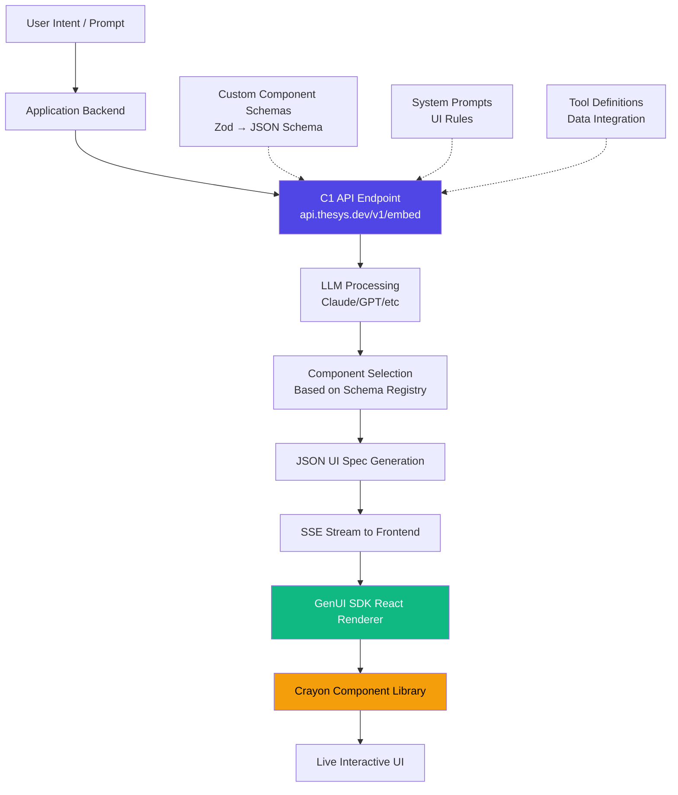
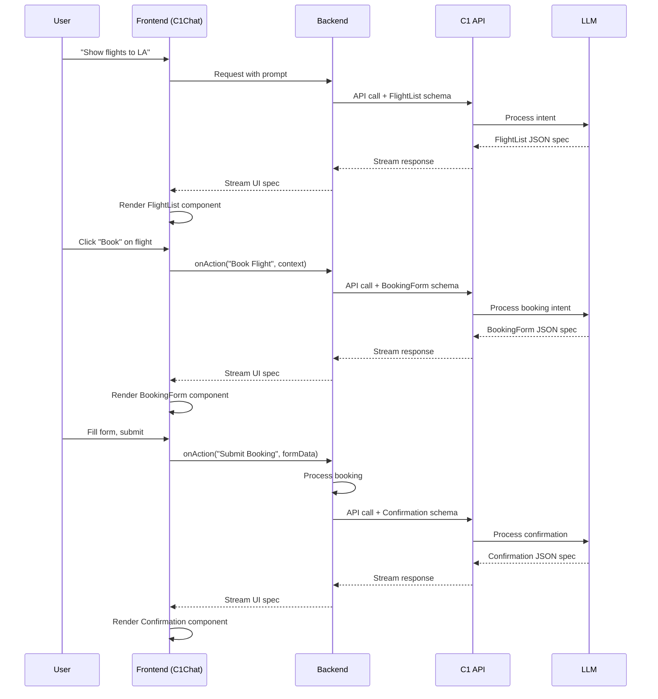

# Thesys C1 Rendering Pipeline: Deep Technical Research

> Status: Research/Input
> Runtime Contract: `docs/architecture.md`
> This document is design/research guidance, not runtime source-of-truth.

**Research Date:** 2026-02-10
**Focus:** How C1 transforms LLM responses into polished, production-ready UI

---

## Executive Summary

Thesys C1 achieves high-quality generative UI through a **spec-based rendering pipeline** that treats UI as structured data rather than generated code. The system uses:

1. **Schema-driven component selection** — LLM chooses from registered Zod schemas based on intent
2. **Progressive SSE streaming** — Components render incrementally during LLM inference
3. **Crayon design system** — Pre-built accessible React components (Radix UI + shadcn patterns)
4. **Quality enforcement via constraints** — System prompts, schema validation, and composable component primitives prevent ugly output

**Key Insight:** C1 doesn't generate code or raw HTML. Instead, it outputs a **JSON-based UI specification** that maps to pre-defined React components, ensuring visual consistency and reliability.

---

## 1. The C1 Rendering Pipeline

### 1.1 High-Level Architecture



### 1.2 Request-Response Flow

**Step 1: Backend Configuration**

The backend registers component schemas and tools with the C1 API:

```typescript
// Convert Zod schemas to JSON Schema format
const CUSTOM_COMPONENT_SCHEMAS = {
  FlightList: zodToJsonSchema(FlightListSchema),
  OrderForm: zodToJsonSchema(OrderFormSchema),
  Analytics: zodToJsonSchema(AnalyticsSchema),
};

// Initialize OpenAI-compatible client
const client = new OpenAI({
  baseURL: "https://api.thesys.dev/v1/embed/",
  apiKey: process.env.THESYS_API_KEY,
});

// Make request with component schemas in metadata
const llmStream = client.chat.completions.runTools({
  model: "c1/anthropic/claude-sonnet-4/v-20250915",
  messages: conversationHistory,
  tools: toolDefinitions,
  metadata: {
    thesys: JSON.stringify({
      c1_custom_components: CUSTOM_COMPONENT_SCHEMAS,
    }),
  },
});
```

**Step 2: LLM Component Selection**

The LLM receives:
- User's natural language prompt
- Available component schemas (with `.describe()` text for intent matching)
- System prompts defining UI rules
- Tool definitions for data fetching

The LLM then:
1. Analyzes user intent
2. Matches intent to appropriate component schema(s)
3. Generates a **JSON specification** (not code) conforming to the selected schema
4. Streams this specification back to the client

**Step 3: Progressive Frontend Rendering**

```typescript
// Frontend React component
import { C1Chat, ThemeProvider } from "@thesysai/genui-sdk";

export default function App() {
  return (
    <ThemeProvider>
      <C1Chat
        apiUrl="/api/chat"
        theme={{ mode: 'dark' }}
        customizeC1={{
          customComponents: { FlightList, OrderForm, Analytics },
        }}
      />
    </ThemeProvider>
  );
}
```

The `C1Chat` component:
1. Receives the streaming JSON spec from the backend
2. Parses component names and props
3. Maps component names to registered React components
4. Renders components **progressively** as the stream arrives
5. Manages state, interactions, and re-renders

---

## 2. Crayon Design System: The Visual Quality Layer

### 2.1 Architecture Foundation

**Core Principles:**
- Built on **Radix UI primitives** for accessibility (WCAG-compliant out of the box)
- Incorporates **shadcn/ui patterns** for developer familiarity
- **Mobile-first responsive design** embedded in all components
- **Tailwind CSS** for styling with CSS variables for theming

**Component Structure:**
```
@crayonai/react-ui
├── Primitives (Radix UI based)
│   ├── Button
│   ├── Card
│   ├── Form fields (Input, Select, Checkbox)
│   ├── Charts (via visualization libraries)
│   ├── Tables (data grids)
│   └── Modals, Dialogs, Popovers
└── Composite Components
    ├── Analytics dashboards
    ├── Multi-step forms
    └── Custom layouts
```

### 2.2 Theming and Styling

**Theme System:**
```typescript
<ThemeProvider>
  <C1Chat theme={{ mode: 'dark' }} />
</ThemeProvider>
```

**Styling Approach:**
- **Tailwind CSS utility classes** for component styling
- **CSS variables** for design tokens (colors, spacing, typography)
- **Dark mode** included by default
- **Responsive breakpoints** handled automatically by component primitives

**Quality Enforcement:**
1. **Pre-configured props** — Components have sensible defaults
2. **Accessibility built-in** — ARIA attributes, keyboard navigation, focus management
3. **Event handlers included** — onClick, onChange, etc. already wired up
4. **Responsive by default** — Mobile-first grid/flex layouts

---

## 3. Component Resolution Strategy

### 3.1 Schema Registration and Selection

**Schema Definition Pattern:**

```typescript
const FlightListSchema = z
  .object({
    flights: z.array(
      z.object({
        flightNumber: z.string(),
        departure: z.string(),
        arrival: z.string(),
        price: z.number(),
        imageSrc: z.string().optional(),
      })
    ),
  })
  .describe(
    "Displays a list of available flights. Renders rich cards with flight details, departure/arrival times, and pricing."
  );
```

**Critical Requirements:**
1. **Descriptive text** — The `.describe()` text guides LLM component selection
2. **Name matching** — Schema key must match React component name exactly
3. **Type safety** — Zod ensures runtime validation of props

**How the LLM Chooses Components:**

The LLM analyzes:
- User query: "Show me flights from NYC to SF"
- Available schemas with descriptions
- Context about what data is available

It then selects the best-matching schema and generates:
```json
{
  "component": "FlightList",
  "props": {
    "flights": [
      {
        "flightNumber": "AA123",
        "departure": "JFK 10:30 AM",
        "arrival": "SFO 1:45 PM",
        "price": 299
      }
    ]
  }
}
```

### 3.2 Default Components vs Custom Components

**Default Component Mapping:**
- Data queries → Tables, Charts, Visualizations
- Form requirements → Input fields, Selectors, Validation UI
- Action requests → Buttons, Modals, Interactive elements
- Information display → Cards, Lists, Structured layouts

**Custom Components:**
Developers can extend the system with domain-specific components by:
1. Creating a React component with typed props
2. Defining a Zod schema for those props
3. Registering the component in `customComponents` prop
4. Passing the schema in `c1_custom_components` metadata

### 3.3 Layout Determination

**Layout Strategy:**
- Components use **flexbox and grid** layouts from Tailwind
- **Responsive breakpoints** are handled by Crayon primitives
- **Spacing and gaps** follow design system tokens
- **Parent-child relationships** are determined by component nesting in the JSON spec

**Example Layout Generation:**
```json
{
  "component": "Container",
  "props": {
    "layout": "vertical",
    "gap": 24,
    "padding": 32
  },
  "children": [
    { "component": "Header", "props": {...} },
    { "component": "StatsGrid", "props": {...} },
    { "component": "ChartSection", "props": {...} }
  ]
}
```

---

## 4. Progressive Streaming: The "Typewriter for UI" Effect

### 4.1 SSE Streaming Implementation

**Backend Stream Creation:**

```typescript
// API route handler
export async function POST(req: Request) {
  const stream = new ReadableStream({
    async start(controller) {
      const llmStream = await client.chat.completions.runTools({
        model: "c1-nightly",
        messages: await req.json(),
        stream: true,
      });

      for await (const chunk of llmStream) {
        // Forward chunks to client
        controller.enqueue(encoder.encode(chunk));
      }

      controller.close();
    },
  });

  return new Response(stream, {
    headers: { "Content-Type": "text/event-stream" },
  });
}
```

**Frontend Stream Consumption:**

```typescript
const [c1Response, setC1Response] = useState("");
const [isStreaming, setIsStreaming] = useState(false);

const generateArtifact = async () => {
  setIsStreaming(true);
  setC1Response("");

  const response = await fetch("/api/generate-artifact", { method: "POST" });
  const reader = response.body.getReader();
  const decoder = new TextDecoder();
  let accumulatedResponse = "";

  while (true) {
    const { done, value } = await reader.read();
    if (done) break;

    const chunk = decoder.decode(value);
    accumulatedResponse += chunk;
    setC1Response(accumulatedResponse);  // Triggers re-render
  }

  setIsStreaming(false);
};
```

**Rendering Component:**

```tsx
<C1Component
  c1Response={c1Response}
  isStreaming={isStreaming}
/>
```

### 4.2 Partial Component Trees

**How Partial Rendering Works:**

1. **Chunk arrival:** `{"component": "Fli...`
2. **Parser detects incomplete JSON** — Shows loading skeleton
3. **More chunks:** `...ghtList", "props": {"fl...`
4. **Still incomplete** — Skeleton persists
5. **Complete object:** `...ights": [...]}}`
6. **Parser validates** — Complete component now renderable
7. **Component mounts** — FlightList appears with data

**Key Features:**
- **Incremental DOM updates** — React reconciliation handles partial trees
- **Loading states** — Skeleton screens show during parsing
- **Error boundaries** — Invalid chunks don't crash the entire UI
- **Component lifecycle** — useEffect hooks run as components mount progressively

### 4.3 Animation on Component Entrance

**Built-in Animations:**
- Fade-in effects for new components
- Slide-in animations for list items
- Skeleton → real content transitions
- Smooth height/width transitions

**Implementation:**
Crayon components likely use CSS transitions:
```css
.c1-component {
  animation: fadeIn 0.3s ease-in;
}

@keyframes fadeIn {
  from { opacity: 0; transform: translateY(10px); }
  to { opacity: 1; transform: translateY(0); }
}
```

---

## 5. Quality Enforcement Mechanisms

### 5.1 Token System Constraints

**Schema-Based Constraints:**
- **Zod validation** — Props must match schema, invalid data rejected
- **Type safety** — TypeScript ensures component props are correct
- **Runtime validation** — `safeParse()` prevents crashes from bad LLM output

**Example Validation:**
```typescript
const result = FlightListSchema.safeParse(llmOutput.props);
if (!result.success) {
  // Show error state instead of broken component
  return <ErrorFallback error={result.error} />;
}
return <FlightList {...result.data} />;
```

### 5.2 Component Composition Rules

**Enforced Patterns:**
1. **Primitive components only** — No arbitrary HTML/JSX generation
2. **Predefined layouts** — Vertical, horizontal, grid patterns from design system
3. **Nested composition** — Components can contain children, but structure is constrained
4. **State management** — useC1State hook for per-component state, scoped to response

**Anti-Pattern Prevention:**
- **No inline styles** — All styling via Tailwind classes
- **No arbitrary code execution** — Only data-driven rendering
- **No layout drift** — Components use design tokens for spacing/sizing

### 5.3 Layout Algorithm

**Responsive Breakpoint System:**

Crayon uses Tailwind's default breakpoints:
- `sm`: 640px
- `md`: 768px
- `lg`: 1024px
- `xl`: 1280px
- `2xl`: 1536px

Components adapt automatically:
```tsx
<div className="grid grid-cols-1 md:grid-cols-2 lg:grid-cols-3 gap-4">
  {/* Cards automatically reflow based on viewport */}
</div>
```

**Layout Composition:**
- **Container components** define layout direction (vertical/horizontal/grid)
- **Gap and padding** use design tokens (4, 8, 16, 24, 32px scale)
- **Fill vs fixed sizing** — Components can fill container or use fixed dimensions
- **Alignment and justification** — Flexbox properties control positioning

### 5.4 System Prompt Engineering

**UI Rules in System Prompts:**

Example from documentation:
```xml
<ui_rules>
- Always add the imageSrc to the list component
- Use vertical layouts for mobile-first design
- Prefer cards over tables for small datasets
- Include loading states for async actions
- Use error boundaries for form validation
</ui_rules>
```

**Quality Guidelines:**
- "Render data queries as charts/tables"
- "User customizations become inputs/selectors/forms"
- "Text-heavy blocks turn into aesthetically pleasing UI"
- "Always maintain accessibility (ARIA labels, keyboard nav)"

---

## 6. Why Spec-Based Rendering Works

### 6.1 Code Generation is Unreliable

**Problems with Generated Code:**
1. **Syntax errors** — LLMs make typos, miss semicolons, generate invalid JSX
2. **Security risks** — Arbitrary code execution, XSS vulnerabilities
3. **No type safety** — Generated code bypasses TypeScript
4. **Inconsistent quality** — Styling, accessibility vary wildly
5. **Debugging nightmare** — Generated code is hard to trace

### 6.2 Spec-Based Approach Benefits

**Advantages:**
1. **Reliability** — Component library is pre-tested and debugged
2. **Security** — No code execution, only data-driven rendering
3. **Type safety** — Zod validation ensures props match schema
4. **Consistent quality** — All components follow design system
5. **Debuggable** — Component tree is inspectable in React DevTools

**The Key Insight:**
> "Treat UI as data to interpret, not code to generate"

Instead of asking the LLM to write React code, ask it to output a JSON structure that describes WHAT to show. The rendering engine (GenUI SDK) handles HOW to show it.

### 6.3 Token Efficiency

**Why This Matters:**
- **Smaller responses** — JSON specs are more compact than full JSX
- **Faster streaming** — Less data to transmit
- **Lower costs** — Fewer tokens consumed per request
- **Better caching** — Component library cached, only data varies

---

## 7. State Management and Interactivity

### 7.1 useC1State Hook

**Purpose:** Per-component, per-response state management

```typescript
import { useC1State } from "@thesysai/genui-sdk";

export const FlightList = ({ flights }) => {
  const { getValue, setValue } = useC1State("FlightList");

  const selectedFlight = getValue("selectedFlight");

  const handleSelect = (flight) => {
    setValue("selectedFlight", flight);
  };

  return (
    <div>
      {flights.map(flight => (
        <Card
          key={flight.id}
          onClick={() => handleSelect(flight)}
          selected={selectedFlight?.id === flight.id}
        >
          {/* ... */}
        </Card>
      ))}
    </div>
  );
};
```

**Features:**
- **Scoped to response** — State persists within a single LLM response
- **Automatic serialization** — State can be passed back to LLM for context
- **Type-safe** — getValue/setValue are typed

### 7.2 useOnAction Hook

**Purpose:** Send user interactions back to the LLM

```typescript
import { useOnAction } from "@thesysai/genui-sdk";

export const FlightList = ({ flights }) => {
  const onAction = useOnAction();

  const handleBooking = (flight) => {
    onAction(
      "Book Flight",  // Action name
      `User selected flight ${flight.flightNumber} for $${flight.price}`  // Context
    );
  };

  return (
    <div>
      {flights.map(flight => (
        <Button onClick={() => handleBooking(flight)}>
          Book Now
        </Button>
      ))}
    </div>
  );
};
```

**Workflow:**
1. User clicks "Book Now"
2. `onAction()` sends message to backend
3. Backend forwards to C1 API with new context
4. LLM generates next step (e.g., booking form component)
5. New component streams to frontend

### 7.3 Multi-Step Workflows

**Example: Booking Flow**



---

## 8. Key Insights for AgentPing Polymorph System

### 8.1 Critical Architectural Decisions

**1. Adopt Spec-Based Rendering, Not Code Generation**

Don't ask the LLM to generate HTML, JSX, or Svelte code. Instead:
- Define a JSON schema for your "polymorph spec"
- Have the LLM output structured data conforming to that schema
- Build a renderer that maps spec → Svelte components

**2. Component Registry is Essential**

Create a registry mapping component names to Svelte components:
```typescript
const POLYMORPH_REGISTRY = {
  AgentCard: AgentCardComponent,
  MetricsDashboard: MetricsDashboardComponent,
  ConversationThread: ConversationThreadComponent,
};
```

**3. Schema Descriptions Drive Selection**

Use Zod (or similar) with rich descriptions:
```typescript
const AgentCardSchema = z.object({
  agentId: z.string(),
  status: z.enum(['online', 'busy', 'offline']),
  metrics: z.object({
    tasksCompleted: z.number(),
    avgResponseTime: z.number(),
  }),
}).describe(
  "Displays a live agent status card with real-time metrics, including task completion and response times. Use when showing agent health or availability."
);
```

**4. Progressive Streaming is Key to UX**

Implement SSE streaming with:
- Backend streaming JSON chunks
- Frontend accumulating and re-rendering as chunks arrive
- Skeleton/loading states during incomplete parse
- Smooth transitions when components mount

**5. Design System Prevents Ugly Output**

Build a constrained component library:
- Use Tailwind for consistent styling
- Pre-define layouts (vertical, horizontal, grid)
- Use design tokens for spacing, colors, typography
- Include accessibility by default

### 8.2 What AgentPing Polymorph Needs

**Current State Analysis:**
- AgentPing likely uses markdown or plain text rendering
- Needs a way to show agent responses as rich, interactive UI
- Should support real-time updates (agent status, metrics)

**Required Changes:**

**1. Define Polymorph Schema**

```typescript
// schemas/polymorph.ts
export const PolymorphSpec = z.object({
  component: z.string(),  // Component name from registry
  props: z.record(z.unknown()),  // Component-specific props
  children: z.array(z.lazy(() => PolymorphSpec)).optional(),
});

// Example component schemas
export const AgentStatusSchema = z.object({
  agents: z.array(z.object({
    id: z.string(),
    name: z.string(),
    status: z.enum(['online', 'busy', 'offline']),
    currentTask: z.string().optional(),
  })),
}).describe("Shows a grid of agent status cards with real-time updates");

export const TaskTimelineSchema = z.object({
  tasks: z.array(z.object({
    id: z.string(),
    title: z.string(),
    status: z.enum(['pending', 'in-progress', 'completed', 'failed']),
    timestamp: z.string(),
    agent: z.string(),
  })),
}).describe("Displays a chronological timeline of tasks across all agents");
```

**2. Build Component Registry**

```typescript
// registry/components.ts
import AgentStatus from './components/AgentStatus.svelte';
import TaskTimeline from './components/TaskTimeline.svelte';
import MetricsChart from './components/MetricsChart.svelte';

export const POLYMORPH_COMPONENTS = {
  AgentStatus,
  TaskTimeline,
  MetricsChart,
};

export const POLYMORPH_SCHEMAS = {
  AgentStatus: zodToJsonSchema(AgentStatusSchema),
  TaskTimeline: zodToJsonSchema(TaskTimelineSchema),
  MetricsChart: zodToJsonSchema(MetricsChartSchema),
};
```

**3. Create Polymorph Renderer**

```svelte
<!-- PolymorphRenderer.svelte -->
<script lang="ts">
  import { POLYMORPH_COMPONENTS } from './registry/components';

  export let spec: string;  // JSON spec from LLM
  export let isStreaming: boolean = false;

  let parsedSpec;
  $: {
    try {
      parsedSpec = JSON.parse(spec);
    } catch {
      parsedSpec = null;  // Incomplete JSON during streaming
    }
  }

  function renderComponent(node) {
    const Component = POLYMORPH_COMPONENTS[node.component];
    if (!Component) {
      console.warn(`Unknown component: ${node.component}`);
      return null;
    }
    return { Component, props: node.props, children: node.children };
  }
</script>

{#if parsedSpec}
  {#if renderComponent(parsedSpec)}
    {@const { Component, props, children } = renderComponent(parsedSpec)}
    <Component {...props}>
      {#if children}
        {#each children as child}
          <svelte:self spec={JSON.stringify(child)} />
        {/each}
      {/if}
    </Component>
  {/if}
{:else if isStreaming}
  <SkeletonLoader />
{/if}
```

**4. Implement Streaming Backend**

```typescript
// api/polymorph/generate.ts
export async function POST(req: Request) {
  const { prompt, schemas } = await req.json();

  const stream = new ReadableStream({
    async start(controller) {
      const client = new Anthropic({
        apiKey: process.env.ANTHROPIC_API_KEY,
      });

      const response = await client.messages.stream({
        model: "claude-sonnet-4-5",
        max_tokens: 4096,
        messages: [
          {
            role: "user",
            content: `${prompt}\n\nAvailable components:\n${JSON.stringify(schemas, null, 2)}\n\nRespond with a JSON spec using these components.`
          }
        ],
      });

      for await (const chunk of response) {
        if (chunk.type === 'content_block_delta') {
          controller.enqueue(
            new TextEncoder().encode(chunk.delta.text)
          );
        }
      }

      controller.close();
    },
  });

  return new Response(stream, {
    headers: { "Content-Type": "text/event-stream" },
  });
}
```

**5. Integrate with AgentPing**

```svelte
<!-- AgentPingDashboard.svelte -->
<script lang="ts">
  import PolymorphRenderer from './PolymorphRenderer.svelte';
  import { POLYMORPH_SCHEMAS } from './registry/components';

  let polymorphSpec = '';
  let isStreaming = false;

  async function handleAgentQuery(query: string) {
    isStreaming = true;
    polymorphSpec = '';

    const response = await fetch('/api/polymorph/generate', {
      method: 'POST',
      body: JSON.stringify({
        prompt: query,
        schemas: POLYMORPH_SCHEMAS,
      }),
    });

    const reader = response.body.getReader();
    const decoder = new TextDecoder();

    while (true) {
      const { done, value } = await reader.read();
      if (done) break;

      polymorphSpec += decoder.decode(value);
    }

    isStreaming = false;
  }
</script>

<div class="agentping-dashboard">
  <input
    type="text"
    placeholder="Ask about agent status..."
    on:submit={(e) => handleAgentQuery(e.target.value)}
  />

  <PolymorphRenderer {polymorphSpec} {isStreaming} />
</div>
```

### 8.3 Quality Checklist

**Before Shipping:**

- [ ] All components use design system tokens (spacing, colors, typography)
- [ ] Components are responsive (mobile, tablet, desktop)
- [ ] Accessibility built-in (ARIA labels, keyboard nav, focus states)
- [ ] Error boundaries handle invalid LLM output gracefully
- [ ] Loading states show during streaming
- [ ] Smooth animations on component entrance
- [ ] Schema validation prevents crashes from bad data
- [ ] Component registry is type-safe
- [ ] System prompts guide LLM toward good component choices
- [ ] Progressive rendering works smoothly (no flash of incomplete UI)

---

## 9. Additional Resources

### Official Thesys Documentation
- [Building the First Generative UI API](https://www.thesys.dev/blogs/generative-ui-architecture)
- [How to Build Generative UI Applications](https://www.thesys.dev/blogs/how-to-build-generative-ui-applications)
- [Implementing Custom Components](https://docs.thesys.dev/guides/custom-components)
- [Rendering & Streaming Artifacts](https://docs.thesys.dev/guides/artifacts/rendering)
- [What is C1 by Thesys?](https://docs.thesys.dev/)

### Technical Articles
- [Thesys Is Reimagining UI](https://medium.com/@knbrahmbhatt_4883/thesys-is-reimagining-ui-one-generative-interface-at-a-time-bcb247aa3c59)
- [Thesys Builds the Future of Generative UI on MongoDB Atlas](https://www.mongodb.com/company/blog/innovation/thesys-builds-future-of-generative-ui-mongodb-atlas)
- [Thesys C1: Make LLMs Respond with Interactive UI](https://chatgate.ai/post/thesys-c1/)

### Code Repositories
- [Crayon GenUI SDK](https://github.com/thesysdev/crayon)
- [Example Integrations](https://github.com/thesysdev/examples)
- [C1 Templates](https://github.com/thesysdev/template-c1-next)

### Design System References
- [shadcn/ui](https://ui.shadcn.com/) — Tailwind-based component library
- [Radix UI](https://www.radix-ui.com/) — Accessible React primitives
- [What is the difference between Radix and shadcn-ui?](https://workos.com/blog/what-is-the-difference-between-radix-and-shadcn-ui)

---

## 10. Conclusion

Thesys C1 achieves production-quality generative UI by:

1. **Treating UI as structured data** (spec-based rendering)
2. **Using a constrained component library** (Crayon design system)
3. **Progressive streaming** for real-time feedback
4. **Schema-driven selection** with rich LLM guidance
5. **Quality enforcement** through validation, system prompts, and design tokens

For AgentPing's polymorph system, the key takeaway is: **don't generate code, generate data that describes what to render**. Build a Svelte component library, define JSON schemas for each component, and let the LLM choose from the registry based on intent. This approach guarantees visual consistency, reliability, and a polished user experience.

The technical challenge shifts from "how do we make the LLM write good code?" to "how do we build a great component library and help the LLM choose the right component?". The latter is a much more tractable problem.

