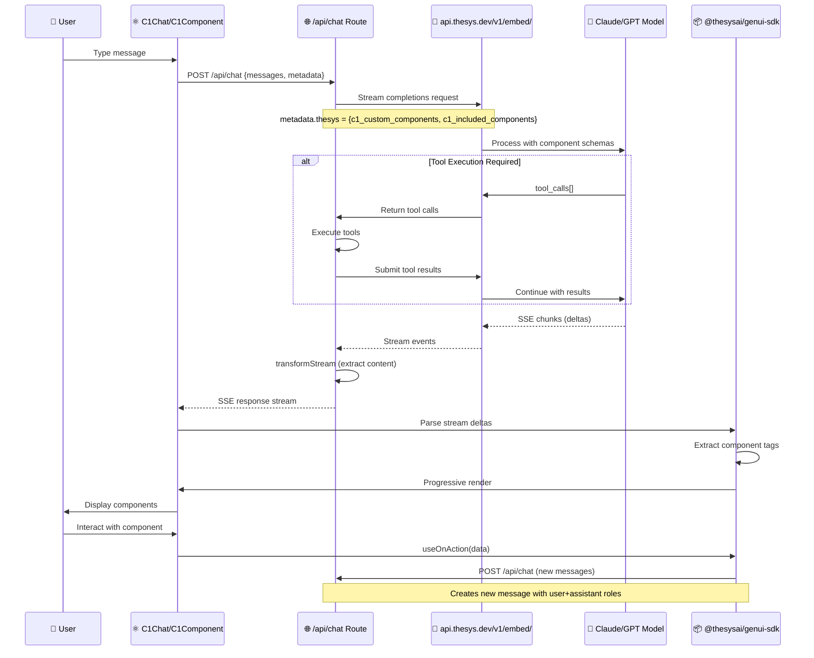
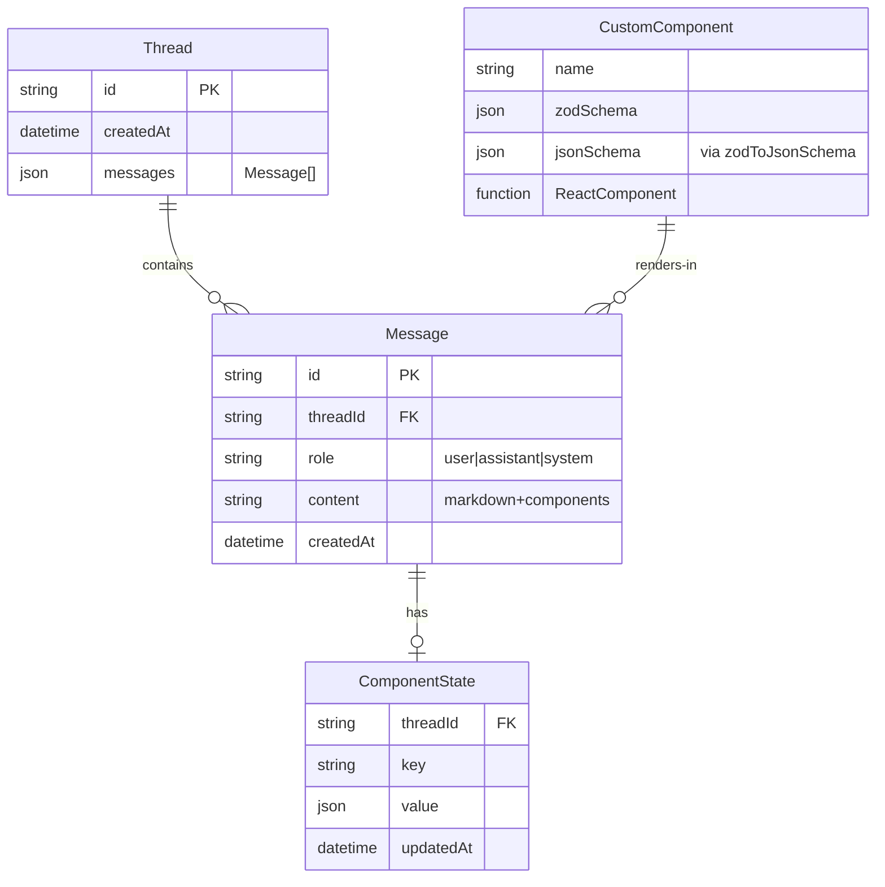
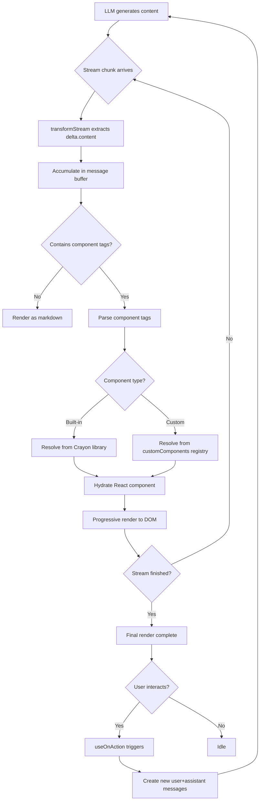

# Thesys C1 Architecture Specification

> Status: Research/Input
> Runtime Contract: `docs/architecture.md`
> This document is design/research guidance, not runtime source-of-truth.

**Mapped to AgentPing Equivalents**

---

## Executive Summary

Thesys C1 is a conversational UI framework that enables LLMs to render custom interactive components directly within chat interfaces. It operates as a specialized layer on top of OpenAI's streaming completions API, with a metadata channel for component schemas and a client-side SDK that progressively renders structured content.

The architecture centers around three core mechanisms: (1) **Component Schema Registration** — Zod schemas converted to JSON Schema and passed to the LLM via API metadata, (2) **Streaming Protocol** — SSE-based OpenAI completions with server-sent events transformed into renderable content, and (3) **Bidirectional State** — Thread-scoped component state (`useC1State`) and human-to-LLM action callbacks (`useOnAction`) that create message round-trips.

Thesys C1 targets **inline chat experiences** where the LLM generates markdown with embedded component tags that are progressively hydrated. This contrasts with AgentPing's **mission control** model, where agents submit structured pings to a central service that routes them to various UIs (web, CLI, Slack, etc.) via a hexagonal architecture.

---

## 1. Request Flow Diagram



---

## 2. Data Model



### Entity Definitions

**Thread**
- In-memory or persisted conversation container
- Messages accumulate with `role: "user" | "assistant" | "system"`
- Managed by `useThreadManager` hook

**Message**
- Content is markdown with embedded component tags: `<ComponentName {...props} />`
- LLM generates tags; SDK hydrates them to React components
- Each message is immutable; interactions create new messages

**ComponentState**
- Key-value store scoped to `threadId`
- Accessed via `useC1State(key, initialValue)`
- Persists across re-renders within a thread
- Not shared between threads

**CustomComponent**
- Zod schema defines props structure
- Schema passed to LLM via `metadata.thesys.c1_custom_components`
- React component registered in `C1Chat.customizeC1.customComponents`
- Props must match schema property names exactly

---

## 3. API Surface

### Base URL
```
https://api.thesys.dev/v1/embed/
```

### Authentication
```typescript
headers: {
  'Authorization': `Bearer ${process.env.THESYS_API_KEY}`,
  'Content-Type': 'application/json'
}
```

### Endpoint: POST /chat/completions

**Request**
```typescript
{
  model: 'c1/anthropic/claude-3.5-sonnet/v-20250617',
  messages: [
    { role: 'user', content: 'Build a dashboard' },
    { role: 'assistant', content: '...' }
  ],
  metadata: {
    thesys: JSON.stringify({
      c1_custom_components: {
        'TaskCard': {
          type: 'object',
          properties: {
            title: { type: 'string', description: 'Task title' },
            status: { type: 'string', enum: ['todo', 'done'] }
          }
        }
      },
      c1_included_components: ['Button', 'Card', 'Input']
    })
  },
  stream: true
}
```

**Response (SSE Stream)**
```
event: message
data: {"id":"chatcmpl-xyz","object":"chat.completion.chunk","choices":[{"index":0,"delta":{"content":"Here"},"finish_reason":null}]}

event: message
data: {"id":"chatcmpl-xyz","choices":[{"delta":{"content":"'s"},"finish_reason":null}]}

event: done
data: [DONE]
```

**Tool Execution Flow**
1. LLM returns `tool_calls` in response
2. Backend executes tools (e.g., database queries, API calls)
3. Results submitted back to LLM via new API call
4. LLM continues generation with tool outputs

---

## 4. SDK Architecture

```
@thesysai/genui-sdk
├── C1Chat                  # Full chat interface with thread management
├── C1Component             # Standalone component renderer
├── ThemeProvider           # Light/dark theming system
├── useOnAction             # Bidirectional state handler
├── useC1State              # Thread-scoped persistent state
├── useThreadManager        # Thread CRUD operations
└── useThreadListManager    # Thread listing/search

Dependencies:
├── @crayonai/react-ui      # Crayon design system
│   └── styles/index.css    # Component styles
├── @crayonai/stream        # transformStream (SSE → content)
├── @crayonai/react-core    # Core React primitives
└── openai                  # OpenAI client (for API)
```

### Package Hierarchy

**@thesysai/genui-sdk** (top-level)
- Provides: `C1Chat`, `C1Component`, hooks
- Consumes: OpenAI streaming API, Crayon components
- Role: Orchestration layer for LLM-driven UIs

**@crayonai/react-ui** (design system)
- Provides: Built-in components (Button, Card, Input, etc.)
- Consumed by: genui-sdk for default component library
- Role: Standard component palette

**@crayonai/stream** (streaming utilities)
- Provides: `transformStream` to extract content deltas
- Role: Parse SSE events into renderable chunks

**@crayonai/react-core** (primitives)
- Provides: Low-level React utilities
- Role: Shared foundation

---

## 5. Rendering Pipeline



### Streaming Behavior

1. **Partial Content Rendering**
   - Chunks render immediately as they arrive
   - Components may be partially formed during streaming
   - SDK handles incomplete tags gracefully

2. **Component Resolution**
   - Built-in components: Resolved from `@crayonai/react-ui`
   - Custom components: Matched by name in `customComponents` map
   - Fallback: Plain text if component not found

3. **State Synchronization**
   - `useC1State` persists across re-renders
   - State changes trigger re-render but don't create new messages
   - `useOnAction` creates new messages for human→LLM feedback

---

## 6. Component System

### Built-in vs Custom

| Aspect | Built-in Components | Custom Components |
|--------|---------------------|-------------------|
| **Source** | `@crayonai/react-ui` | User-provided React components |
| **Schema** | Pre-defined in Crayon library | Zod schema → JSON Schema |
| **Registration** | Automatic (included by default) | Explicit via `customComponents` map |
| **Metadata** | Sent via `c1_included_components` | Sent via `c1_custom_components` |
| **Examples** | Button, Card, Input, Badge | TaskCard, MetricGrid, CustomChart |

### Schema Contract

**1. Define Zod Schema**
```typescript
import { z } from 'zod';

const TaskCardSchema = z.object({
  title: z.string().describe('Task title'),
  status: z.enum(['todo', 'in-progress', 'done']).describe('Current status'),
  assignee: z.string().optional().describe('Person assigned'),
});
```

**2. Convert to JSON Schema**
```typescript
import { zodToJsonSchema } from 'zod-to-json-schema';

const jsonSchema = zodToJsonSchema(TaskCardSchema, 'TaskCard');
// Pass in metadata.thesys.c1_custom_components
```

**3. Create React Component**
```typescript
function TaskCard({ title, status, assignee }: z.infer<typeof TaskCardSchema>) {
  return (
    <div className="task-card">
      <h3>{title}</h3>
      <Badge variant={status === 'done' ? 'success' : 'default'}>{status}</Badge>
      {assignee && <p>Assigned to: {assignee}</p>}
    </div>
  );
}
```

**4. Register Component**
```typescript
<C1Chat
  customizeC1={{
    customComponents: {
      TaskCard: TaskCard
    }
  }}
/>
```

**CRITICAL**: Props in React component **must match** schema property names exactly. The LLM uses the schema to generate valid props.

---

## 7. State Management

### Thread Persistence

```typescript
// In-memory (default)
const [threads, setThreads] = useState<Thread[]>([]);

// Persisted (optional)
const { threads, createThread, deleteThread } = useThreadManager({
  storage: new LocalStorageAdapter()
});
```

**Storage Backends**
- In-memory: Default, lost on page refresh
- LocalStorage: Client-side persistence
- Database: Server-side persistence (custom implementation)

### Component State

```typescript
// Inside a custom component
function MetricCard() {
  const [isExpanded, setIsExpanded] = useC1State('metric-expanded', false);
  // State persists within thread, survives re-renders
  // NOT shared between threads or components
}
```

**Scoping Rules**
- State is keyed by `(threadId, key)`
- Different threads have isolated state
- State survives component unmount/remount within same thread
- State cleared when thread is deleted

### Tool Execution State

```typescript
// Backend handles tool execution
const tools = [
  {
    type: 'function',
    function: {
      name: 'get_user_data',
      description: 'Fetch user profile',
      parameters: { type: 'object', properties: { userId: { type: 'string' } } }
    }
  }
];

// LLM calls tool
// Backend executes and returns result
// LLM continues with tool output
```

**State Flow**
1. LLM generates `tool_calls` in streaming response
2. Backend accumulates calls until stream finishes
3. Backend executes tools (database queries, API calls, etc.)
4. Results submitted back to LLM in new API call
5. LLM generates final response with tool outputs

---

## 8. AgentPing Mapping

| Thesys C1 Stage | AgentPing Equivalent | Gap Analysis |
|-----------------|----------------------|--------------|
| **OpenAI Streaming API** | MCP Protocol (stdio/SSE) | Different protocol, both valid. AgentPing uses request/response; Thesys uses streaming deltas. |
| **SSE Stream** | Static render (no streaming) | **Gap**: AgentPing renders pings once submitted, no progressive hydration. |
| **metadata.thesys** | `ping.payload` (structured JSON) | Similar concept. Thesys passes schemas; AgentPing passes typed payloads. |
| **useOnAction** | Ping response cycle | Thesys: inline callbacks. AgentPing: discrete response submission. |
| **useC1State** | No direct equivalent | **Gap**: AgentPing has no thread-scoped component state. State is per-ping. |
| **C1Chat** | AgentPing Studio/Web UI | Thesys: embedded chat. AgentPing: standalone mission control. |
| **C1Component** | Polymorph Primitives | Thesys: React-only. AgentPing: multi-target (HTML, Pencil, React). |
| **Custom Components** | Sofia Widgets (Canvas) | Thesys: Zod schema. AgentPing: widget registry with `widgetId`. |
| **Built-in Components** | Polymorph Primitives (12) | Thesys: 30+ Crayon components. AgentPing: 12 primitives + 78 premium. |
| **transformStream** | EventBus (push notifications) | Thesys: streaming content. AgentPing: event-driven updates. |
| **Thread Management** | Ping history (SQLite store) | Thesys: conversations. AgentPing: discrete pings with lifecycle. |
| **Tool Execution** | No direct equivalent | **Gap**: AgentPing has no tool execution layer (agents handle externally). |

### Protocol Comparison

**Thesys C1**: OpenAI-compatible streaming API
- Request: `{messages, metadata, stream: true}`
- Response: SSE chunks with `delta.content`
- State: Thread-scoped, mutable during conversation

**AgentPing**: MCP tools + HTTP/WebSocket
- Request: `{agentId, sessionId, payload}`
- Response: Single ping entity with lifecycle
- State: Immutable ping, human response appends to ping

---

## 9. Key Architectural Differences

### Philosophy

| Dimension | Thesys C1 | AgentPing |
|-----------|-----------|-----------|
| **Primary Use Case** | Inline chat with rich components | Mission control for autonomous agents |
| **Interaction Model** | Conversational back-and-forth | Discrete approval/notification events |
| **Component Rendering** | Progressive streaming hydration | Static render on ping submission |
| **State Model** | Thread-scoped mutable state | Immutable ping with response |
| **Integration** | Embedded in chat UI | Standalone service with adapters |
| **Multi-Channel** | Single UI (chat) | Web, CLI, Slack, Browser Extension, Studio |

### Architecture

| Dimension | Thesys C1 | AgentPing |
|-----------|-----------|-----------|
| **Core Pattern** | Streaming API + SDK | Hexagonal (Ports & Adapters) |
| **Protocol** | OpenAI SSE streaming | MCP + HTTP + WebSocket |
| **Component System** | React-only (Crayon + custom) | Polymorph (HTML, Pencil, React) |
| **Schema Contract** | Zod → JSON Schema → LLM metadata | Typed payloads (12 ping types) |
| **Tool Execution** | Server-side tool handler | N/A (agents handle externally) |
| **Storage** | Optional (in-memory/localStorage/DB) | Required (SQLite store) |
| **Event System** | Stream deltas | EventBus with typed events |

### Component Systems

| Dimension | Thesys C1 | AgentPing |
|-----------|-----------|-----------|
| **Built-in Count** | 30+ (Crayon library) | 12 primitives + 78 premium |
| **Custom Registration** | `customComponents` map | Sofia widget registry |
| **Schema Definition** | Zod schema with `.describe()` | `widgetId` + `data` object |
| **Render Targets** | React-only | HTML, Pencil (.pen), React |
| **Theming** | ThemeProvider (light/dark) | 3 themes (terminal-swiss, skynet, system) |
| **Templates** | N/A | 4 templates (design, data, concept, critique) |

---

## 10. Extension Points: Adding Thesys Capabilities to AgentPing

### 1. Streaming Ping Rendering

**Current State**: AgentPing pings are rendered once on submission.

**Thesys Capability**: Progressive streaming hydration of component content.

**Extension Point**:
- Add `stream: boolean` flag to `CreatePingRequest`
- Implement SSE endpoint in `packages/adapters/http-api`
- Add streaming parser to `packages/core/src/parsers`
- Extend `INotificationChannel` to handle delta updates

**Implementation Path**:
```typescript
// packages/core/src/domain/ping.ts
export interface CreatePingRequest {
  // ... existing fields
  stream?: boolean;
  streamMetadata?: {
    componentSchemas: Record<string, JSONSchema>;
  };
}

// packages/adapters/http-api/src/routes/pings.ts
router.post('/pings/stream', async (req, res) => {
  const ping = await pingService.submitStreamingPing(req.body);
  res.setHeader('Content-Type', 'text/event-stream');
  // Emit deltas as they arrive
});
```

### 2. Thread-Scoped Component State

**Current State**: AgentPing has no thread concept; each ping is isolated.

**Thesys Capability**: `useC1State` for persistent component state within a thread.

**Extension Point**:
- Add `Thread` entity to core domain
- Extend `IPingStore` to support thread grouping
- Add state store keyed by `(threadId, componentKey)`
- Extend `CanvasInteractionPayload` to include state operations

**Implementation Path**:
```typescript
// packages/core/src/domain/thread.ts
export interface Thread {
  id: string;
  sessionId: string;
  pings: string[]; // ping IDs
  state: Record<string, unknown>; // thread-scoped state
  createdAt: Date;
}

// packages/core/src/ports/store.ts
export interface IPingStore {
  // ... existing methods
  saveThreadState(threadId: string, key: string, value: unknown): Promise<void>;
  getThreadState(threadId: string, key: string): Promise<unknown | null>;
}
```

### 3. Custom Component Schema System

**Current State**: AgentPing uses `widgetId` + opaque `data` object.

**Thesys Capability**: Zod schemas for type-safe component props.

**Extension Point**:
- Add Zod schema to Sofia widget definitions
- Generate JSON Schema for LLM consumption
- Validate `props.data` against schema before rendering
- Extend MCP tools to accept schema metadata

**Implementation Path**:
```typescript
// packages/canvas/src/widgets/registry.ts
import { z } from 'zod';

export const WIDGET_SCHEMAS = {
  'bd-dashboard': z.object({
    columns: z.array(z.string()),
    cards: z.array(z.object({
      id: z.string(),
      title: z.string(),
      status: z.string(),
    })),
  }),
};

// Validate before render
const schema = WIDGET_SCHEMAS[widgetId];
if (schema) {
  const validated = schema.parse(props.data);
  // Render with validated data
}
```

### 4. Tool Execution Layer

**Current State**: AgentPing has no tool execution; agents handle externally.

**Thesys Capability**: Server-side tool execution with LLM feedback loop.

**Extension Point**:
- Add `ToolExecutionPayload` ping type
- Implement tool registry in core
- Add tool executor service in daemon
- Extend MCP adapter to expose tools

**Implementation Path**:
```typescript
// packages/core/src/domain/ping.ts
export const ToolExecutionPayloadSchema = z.object({
  type: z.literal('tool_execution'),
  toolName: z.string(),
  parameters: z.record(z.string(), z.unknown()),
});

// packages/daemon/src/tools/registry.ts
export class ToolRegistry {
  private tools = new Map<string, ToolHandler>();

  register(name: string, handler: ToolHandler) {
    this.tools.set(name, handler);
  }

  async execute(name: string, params: unknown): Promise<unknown> {
    const handler = this.tools.get(name);
    if (!handler) throw new Error(`Tool not found: ${name}`);
    return handler(params);
  }
}
```

### 5. Bidirectional Action Callbacks

**Current State**: AgentPing responses are one-shot; no inline callbacks.

**Thesys Capability**: `useOnAction` for human→LLM feedback within a component.

**Extension Point**:
- Add `onAction` handler to Sofia widgets
- Extend `CanvasInteractionPayload` to include action type
- Implement callback registry in Canvas adapter
- Link actions to new ping submissions

**Implementation Path**:
```typescript
// packages/canvas/src/widgets/sofia-widget.tsx
export function SofiaWidget({ widgetId, data, onAction }: SofiaWidgetProps) {
  const handleAction = (actionData: unknown) => {
    // Submit new ping with action data
    pingService.submitPing({
      agentId: 'user',
      agentName: 'Human',
      sessionId: currentSessionId,
      payload: {
        type: 'canvas_interaction',
        action: 'action_callback',
        widgetId,
        actionData,
      },
    });
  };

  return <WidgetRenderer onAction={handleAction} />;
}
```

### 6. Multi-Model API Adapter

**Current State**: AgentPing is model-agnostic (MCP protocol).

**Thesys Capability**: OpenAI streaming API with metadata channel.

**Extension Point**:
- Add OpenAI streaming adapter to `packages/adapters`
- Implement metadata→payload mapping
- Add streaming event parser
- Extend daemon to support streaming mode

**Implementation Path**:
```typescript
// packages/adapters/openai-stream/src/index.ts
import OpenAI from 'openai';

export class OpenAIStreamAdapter {
  async streamPing(request: CreatePingRequest) {
    const openai = new OpenAI({ apiKey: process.env.OPENAI_API_KEY });

    const stream = await openai.chat.completions.create({
      model: 'gpt-4',
      messages: this.toOpenAIMessages(request),
      metadata: { agentping: this.toMetadata(request) },
      stream: true,
    });

    for await (const chunk of stream) {
      const delta = chunk.choices[0]?.delta?.content;
      if (delta) {
        // Emit delta to ping service
      }
    }
  }
}
```

---

## Summary

Thesys C1 is a **streaming conversational UI framework** optimized for inline chat experiences with rich, progressive component rendering. AgentPing is a **hexagonal orchestration platform** for discrete agent-human interactions across multiple channels.

The key architectural divergence is **streaming vs discrete**: Thesys progressively hydrates components as content streams; AgentPing renders static pings on submission. Thesys targets **embedded chat UIs**; AgentPing targets **mission control dashboards**.

To add Thesys-like capabilities to AgentPing:
1. Add streaming ping support (SSE endpoint + delta parsers)
2. Introduce thread concept for state scoping
3. Implement Zod schema validation for Sofia widgets
4. Add tool execution layer to daemon
5. Extend Canvas adapter for bidirectional action callbacks

AgentPing's polymorph rendering system (HTML/Pencil/React) already provides multi-target capabilities that Thesys lacks. The Sofia widget registry parallels Thesys's custom component system but without schema-driven prop validation.

Both systems excel at different points in the agent-human interaction spectrum: Thesys for **conversational co-creation**, AgentPing for **high-fidelity approvals and notifications**.

